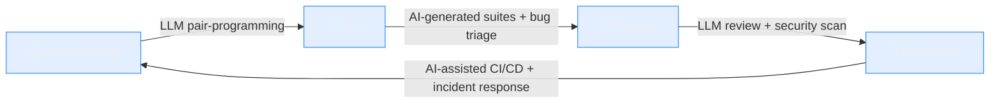

  
  <h1>Hi there, I'm Harun Geçit</h1>

  

   

  

    
    
    
  

  

    
    
    
    
    
    
    
  

  
  
  

 

### 🚀 About Me

I'm a **Full Stack Developer & AI Engineer** based in İstanbul, Türkiye, with **15+ years** in software development and **2+ years** of hands-on **AI/LLM engineering**. I design scalable systems and build with **Large Language Models** every single day.

- 🧠 I engineer **RAG pipelines**, **multi-agent orchestration** and **multi-LLM** systems in production
- 🌱 Currently deep in **AI Infrastructure**, **Cloud Native Development & DevOps**
- 💻 Building products with **Laravel, Go, React & Python**
- 🔐 Exploring **AI-powered code review, vulnerability scanning & security automation**
- 📝 I regularly write on [**echo.harungecit.dev**](https://echo.harungecit.dev)
- 🤝 Open to collaborating on **Open Source** & production **AI systems**
- 📫 Reach me at **info@harungecit.com** — or explore my portfolio at [**harungecit.dev**](https://harungecit.dev)

> 💡 Fun fact: my portfolio is an interactive **"HarunOS"** — a desktop-like OS experience with draggable windows, right in your browser.

 

---

### 🤖 AI & LLM Engineering

<table>
<tr>
<td width="50%" valign="top">

**🧩 What I build**
- RAG pipelines on **PostgreSQL + pgvector**
- Multi-agent orchestration & **multi-LLM** routing
- Fine-tuning & **PageIndex**-based training workflows
- Web-search agents & custom **skills**
- Token accounting & **cost optimization**
- AI-powered **code review & security scanning**

</td>
<td width="50%" valign="top">

**🛠️ Daily AI toolbelt**
- Claude Code · OpenAI Codex · Gemini CLI
- Cursor · GitHub Copilot · TRAE
- Custom agents & orchestration layers
- Embeddings · function calling · prompt engineering
- TensorFlow · Python ML tooling

</td>
</tr>
</table>

**🔄 My LLM-driven development lifecycle**

  
  
  
  
  
  
  

---

### 🛠️ Tech Stack & Arsenal

<h4>Languages & Frameworks</h4>

  

<h4>Databases & Search</h4>

  

<h4>Cloud, DevOps & Infrastructure</h4>

  

<h4>Modern Stack & Tooling</h4>

  
  
  
  
  
  
  
  
  
  
  
  
  
  

---

### 📌 Featured Projects

<table>
<tr>
<td width="50%" valign="top">

**🧠 [RAG Knowledge Engine](https://harungecit.dev)** · `2024–`
Production RAG system on PostgreSQL + pgvector with multi-LLM support.
`PostgreSQL` `pgvector` `LLM` `Python`

**🤝 [Multi-Agent AI Toolkit](https://harungecit.dev)** · `2024–`
LLM orchestration layer routing tasks across multiple models.
`Orchestration` `Multi-LLM` `Agents`

**🎓 [AI Infra Academy](https://harungecit.dev)** · `2025–`
Interactive bilingual app for learning AI infrastructure engineering.
`React` `TypeScript` `Tailwind`

**🧪 [AI Training Platform](https://harungecit.dev)** · `2022–`
Smart training with AI-supported exercises.
`Python` `TensorFlow`

</td>
<td width="50%" valign="top">

**📧 [PHP Email Validator](https://github.com/harungecit)** · `OSS`
Validation library detecting **4,900+** disposable domains.
`PHP` `Composer`

**🛰️ [Vigilon](https://github.com/harungecit)** · `OSS`
Multi-platform service monitoring — Go, SQLite & Docker.
`Go` `SQLite` `Docker`

**🧾 [UBL Viewer](https://github.com/harungecit)** · `OSS`
Browser extension for Turkish e-Invoice & UBL documents.
`Browser Extension` `UBL`

**📝 [Smart Changelists](https://github.com/harungecit)** · `OSS`
VS Code extension with JetBrains-style changelists.
`VS Code` `TypeScript`

</td>
</tr>
</table>

🏭 Also: <b>RFID Tracking System</b> (enterprise textile inventory) · <b>DevTools Platform</b> · <b>BRAISLATOR</b> (Braille translation PWA) — full case studies at <a href="https://harungecit.dev">harungecit.dev</a>

---

### 💼 Experience

| Period | Role | Focus |
| :-- | :-- | :-- |
| **2022 – Now** | Full Stack Developer & **AI Engineer** — *USTEK RFID* | Laravel · RAG · pgvector |
| **2022 – Now** | Software Advisor & **AI Engineer** — *CatchPad* | Python · TensorFlow · multi-LLM |
| **2021 – 2022** | Full Stack Developer — *Gourmeturca.com* | Laravel · ERP integrations |
| **2020 – 2021** | Full Stack Developer — *Sadıkoğulları Teknoloji* | Sentiment analysis · Docker |
| **2011 – 2019** | Freelance Full Stack Developer | WordPress · Server admin |

---

### 🧰 What I Can Help With

`Production AI systems` · `RAG & vector databases` · `LLM integration & orchestration`
`Full stack web development` · `DevOps & cloud infrastructure`
`AI-powered code review & security` · `Consultation & software advisory`

---

### 📊 GitHub Stats

  
  

  

  

 

  <picture>
    <source media="(prefers-color-scheme: dark)" srcset="https://raw.githubusercontent.com/harungecit/harungecit/output/github-contribution-grid-snake-dark.svg">
    <source media="(prefers-color-scheme: light)" srcset="https://raw.githubusercontent.com/harungecit/harungecit/output/github-contribution-grid-snake.svg">
    
  </picture>

---

### ✍️ Latest from the Blog

<!-- BLOG-POST-LIST:START -->
📖 Read my latest articles on **[echo.harungecit.dev](https://echo.harungecit.dev)** — AI infrastructure, RAG, LLM engineering, DevOps & cloud native.
<!-- BLOG-POST-LIST:END -->

 

### 💬 Let's build something

⭐️ From <a href="https://github.com/harungecit">harungecit</a> — <i>designing scalable systems, one LLM at a time.</i>

